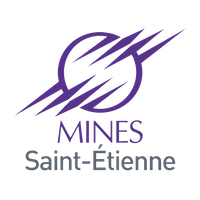

# LignesDeTransport-API

Deployer une application sur Clever Cloud. 
Cette application permet de gérer les données issues de OpenData, des lignes de transport commun en îles-de-France.

Lien de l'application : https://Lignes-ack.cleverapps.io/lignes/

Lien des données : https://data.opendatasoft.com/explore/dataset/referentiel-des-lignes%40stif/api/?disjunctive.transportmode&disjunctive.transportsubmode&disjunctive.operatorname&disjunctive.networkname&sort=transportmode

# Web Development 

## Slides

 1. Web dev history: [link](https://docs.google.com/presentation/d/1G3NzexpajWE-8K_louukRLqgNoU7yIFUqiZ7g5rGV6A/edit?usp=sharing)
 2. TypeScript: [link](https://docs.google.com/presentation/d/18u-UrIIRkzURgRof3yRqo-v0uqOOY5ooE5bbkh7It6E/edit?usp=sharing)
 3. NestJS: [link](https://docs.google.com/presentation/d/16A2KWAtrzli1kY2_uALsbOGIJS8ZP-pPOhl_BZZ7Lag/edit?usp=sharing)
 
# Android Development 

## Slides

Slides are available [here](https://docs.google.com/presentation/d/16A2KWAtrzli1kY2_uALsbOGIJS8ZP-pPOhl_BZZ7Lag/edit?usp=sharing).

# Project 

## Slides

Slides are available [here]( https://docs.google.com/presentation/d/1mwu2xx7_qfCZDfsRxseC94n7oBGYfhw-9xIftaTDbzk/edit#slide=id.p97).
